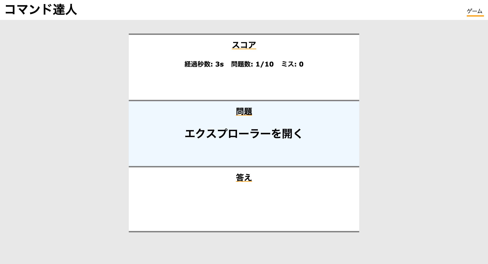
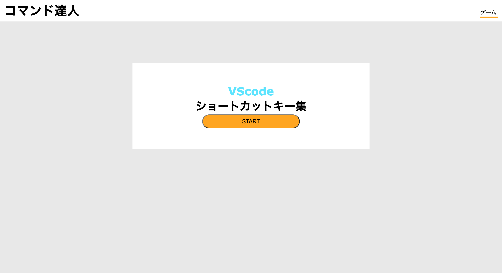
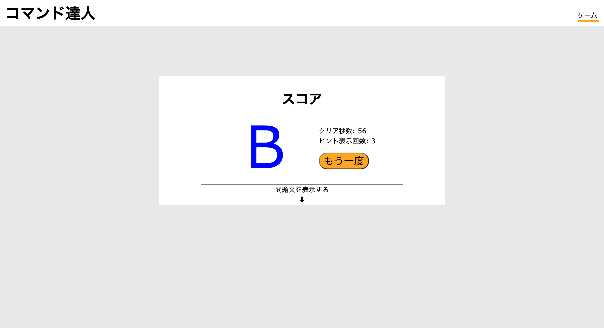

# コマンド達人アプリ

VScodeのよく使うショートカットキーを勉強できるアプリを作った

## 作った理由
vscodeのショートカットキーが一生覚えられないので、ゲームのノリで覚えられるものを探していたが、
有料のものしか見つからなかったので、自分で作ってみようと思った
あと、jsの勉強になるかなとも思ったので、、、

## 使いかた

### 最初の画面
 
上記の画面のstartを押すとゲームがスタートする

### ゲーム画面
 
この画面になったらショートカットキーを入力していただければ合ってれば次の問題へ
5秒間わからなかったら答えの欄に答えが表示されるのでそれを入力しよう

### 終了画面
 
10問時終わると終了画面になり答えを見た回数が確認できる
下の方の矢印を押すと問題文とショートカットキーが表示される。

## 学んだこと
jsをほとんど書いたことがなかったので、いろいろ大変だったがたくさんの学びがあった
その中でもkeydwonやkeyupによって入力しているキーを判断することができるのは大きな学びだった。
ただ、いろんなキーを一気に押したり離したりすると反応が遅い時がある。

## 今後実装してみたいこと
先述した反応が遅い箇所の修復やvscodeのみならず、他のショートカットキーを集めて遊べるゲームを作りたい
あと、実装したかったけど実装できなかったショートカットキーがあるので、実装できるようになりたい
実装できなかった理由はおそらくブラウザのショートカットがページ上のjsより早く反応してしまうため実装できなかった。
いつか解決案が思いついたら実装してみたい。

